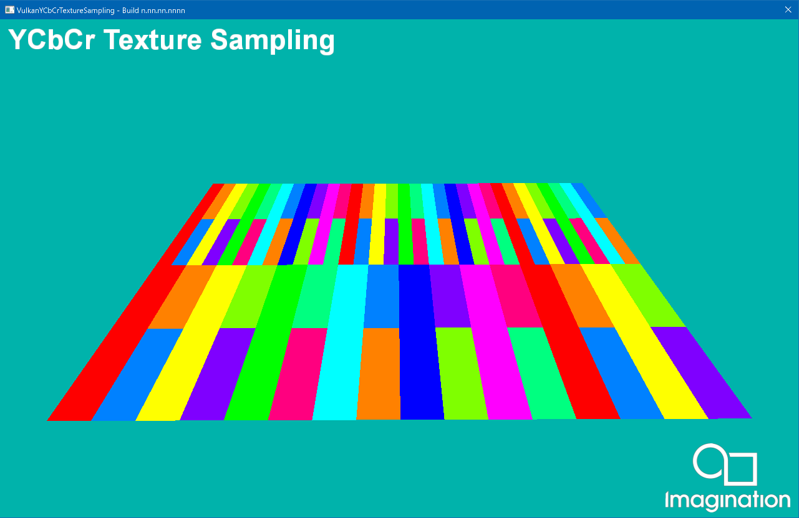

=======
YCbCrTextureSampling
=======

This example demonstrates loading an image using the YCbCr colour format with the PowerVR Framework.

API
---
* Vulkan

Description
-----------
YCbCr is a set of colour spaces designed to represent a colour using separate luma and chroma values. These values are Y, the luminous intensity; and Cb and Cr, which are the blueness and redness. This can also be interpreted as the brightness followed by the coordinates on a colour plane. YCbCr is commonly used in image and video compression because the colour information can be stored at a lower resolution than the brightness, often without noticeably impacting the quality of the image.

Controls
--------
- Quit- Close the application

